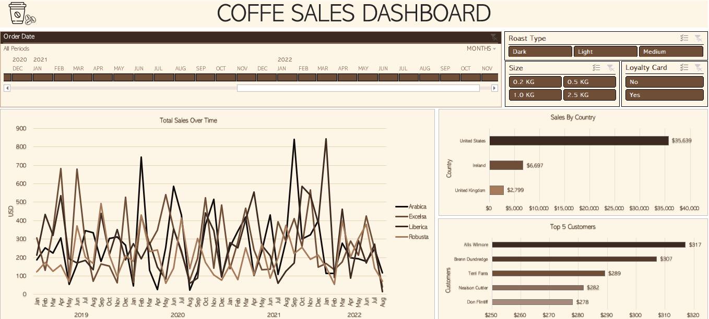

# ☕ Coffee Sales Analysis Dashboard

## 📊 Project Overview
This project is a comprehensive sales performance analysis for a coffee retailer. It transforms raw, fragmented data into an interactive and visually appealing dashboard to drive data-informed business decisions.

---

## 🖥️ Dashboard Preview

*Figure 1: The Interactive Coffee Sales Dashboard*

---

## 🛠️ Technical Challenges & Solutions

### 1. Multi-Dimensional Data Retrieval
One of the key technical hurdles was merging data based on multiple criteria across different tables. Standard lookup functions were insufficient for the complex relationships between the Orders and Products datasets.

**Solution:** I implemented a **2D Lookup** using a manual **INDEX & MATCH** combination. This allowed for dynamic searching across both rows and columns simultaneously.

*Formula: Using INDEX/MATCH to dynamically fetch product data based on header names.*

### 2. Efficient Data Mapping
To ensure high performance and accuracy in linking customer data, I utilized the **XLOOKUP** function.

*Formula: Efficiently retrieving customer details using XLOOKUP.*

---

## 📈 Key Insights & Business Analysis
Based on the analyzed data (2019 - 2022), the following insights were discovered:

* **Market Dominance:** The **United States** is the primary revenue driver, contributing **$35,639** in total sales, which significantly outperforms other regions like Ireland ($6,697) and the UK ($2,799).
* **Customer Loyalty:** Identified the **Top 5 Customers**, with **Alis Wilmore** leading at **$317** in total spending. This data helps in designing VIP loyalty programs.
* **Product Performance:** Sales trends show significant volatility. Notably, **Arabica** and **Liberica** beans frequently hit peak sales volumes, indicating high demand during specific seasons.
* **Strategic Filtering:** The dashboard enables real-time filtering by **Roast Type** (Dark, Light, Medium) and **Package Size** (0.2kg to 2.5kg) to pinpoint specific niche market demands.

---

## 🚀 Features
- **Dynamic Slicers:** Instant filtering by Roast Type, Size, and Loyalty Card status.
- **Interactive Timeline:** A dedicated slider to track sales fluctuations over a 4-year period.
- **Automated Data Pipeline:** Built using Excel Tables to allow for one-click updates (`Refresh All`) when new data is added.

## 📂 Tools Used
- **Microsoft Excel:** Advanced Formulas (INDEX/MATCH, XLOOKUP), Pivot Tables, Pivot Charts.
- **Data Visualization:** Interactive Dashboards, Slicers, and Timelines.